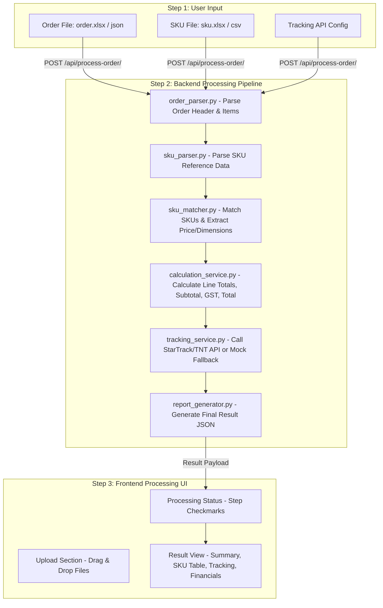

# 项目方向重构分析与设计文档 (PROJECT_ANALYSIS.md)

## 1. 当前实现偏离原题目的原因分析 (Root Cause Analysis)

### 1.1 原题目核心定位
根据 Coding Test 原始需求文档 Section 5：
> *"A script or small application that:*
> *a. Reads the order file*
> *b. Reads the SKU file*
> *c. Calculates Subtotal, GST, Total*
> *d. Retrieves tracking info via API"*

项目的本质定位是一个 **Order Processing Tool（订单文件处理与计算工具）**，而非复杂的 CRUD 订单管理系统 (Order Management System, OMS)。

### 1.2 偏离点对账表

| 维度 | 当前实现 (偏离方向) | 原始题目要求 (正确方向) |
| :--- | :--- | :--- |
| **系统定位** | OMS 订单管理与数据库持久化系统 | 流程化文件处理与实时计算工具 (Order Processing Tool) |
| **数据输入** | 静态数据库查询 / 预置订单号硬编码切换 | 动态上传 Order File (`order.xlsx`/`json`) 与 SKU File (`sku.xlsx`/`csv`) |
| **数据存储** | 强依赖 Django ORM 数据库持久化存储 | 内存处理流 (Pipeline) $\rightarrow$ 生成 Result Payload |
| **前端交互** | 静态订单 Dashboard (Order 1 / Order 2 切卡) | 步骤化 Workflow 界面 (Upload $\rightarrow$ Status $\rightarrow$ Result) |
| **测试验证** | 固定 URL API (`/api/orders/{order_no}/`) | 拖拽/选择文件即时解析、计算与 Tracking 联合呈现 |

---

## 2. 新的系统重构流程 (New System Workflow)

### 完整 6 步处理链路说明：
1. **Step 1: 上传 Order 文件** (包含订单号、客户姓名、电话、邮箱、配送地址、SKU Code、数量、Tracking 编号)。
2. **Step 2: 上传 SKU 文件** (包含 SKU Code、名称、描述、单价 RRP、重量、尺寸、图片 URL)。
3. **Step 3: 自动化解析与匹配**：`order_parser.py` 解析订单，`sku_parser.py` 解析 SKU 文件，`sku_matcher.py` 进行数据对齐与补充。
4. **Step 4: 费用计算**：`calculation_service.py` 计算每行 Line Total、Subtotal、GST 10%、Shipment Fee（算法或 `$0.00`）和 Total。
5. **Step 5: 物流 Tracking API 调用**：`tracking_service.py` 依据 Logistics Company 分发调用 StarTrack/AusPost 或 TNT 客户端。API Key 缺失或测试床网络不可达时自动平滑切至结构相同的 Mock Service。
6. **Step 6: 输出生成**：`report_generator.py` 汇总组合为最终结果 Payload 并由前端 UI 渲染呈现。

---

## 3. UI 改造方案 (Frontend Workflow Refactoring)

### 3.1 废弃组件与功能
- ❌ 废弃顶栏 `Order 1` / `Order 2` 静态导航按钮。
- ❌ 废弃硬编码 `/api/orders/{order_no}/` 的直接加载方式。

### 3.2 新页面结构布局 (`OrderProcessorPage.tsx`)

1. **Upload Section (文件上传与 API 配置区域)**
   * Order File Upload 控件 (拖拽/选择文件，支持 `.json`, `.xlsx`, `.csv`)
   * SKU File Upload 控件 (拖拽/选择文件，支持 `.json`, `.xlsx`, `.csv`)
   * Tracking API Configuration 配置区 (API Key, Username, Pass)
   * 主动作按钮：`Process Order`（启动处理流程）

2. **Processing Status (处理进度与步骤校验指示器)**
   * `[✓]` Order file loaded & parsed
   * `[✓]` SKU data matched & enriched
   * `[✓]` Price & tax calculated
   * `[✓]` Tracking API status synchronized

3. **Result Section (处理结果可视化展示区域)**
   * **Order Summary**: 订单号、客户姓名、邮箱、电话、配送地址
   * **SKU Details Table**: 图片、SKU Code、Product Name、Description、Quantity、Unit Price、Line Total
   * **Tracking Information**: Tracking Number、Logistics Company、Current Status、Last Update
   * **Financial Summary**: Subtotal、GST (10%)、Shipment Fee、Total

---

## 4. Backend 改造方案 (Backend Pipeline Architecture)

放弃 `Database → API → Frontend` 数据库重度依赖模式，改用高灵活性 Pipe-and-Filter 内存处理模式：

$$\text{File Upload (Multipart/Form-Data)} \longrightarrow \text{Process Pipeline API} \longrightarrow \text{Structured Result JSON}$$

### 4.1 新 API 端点
* **Endpoint**: `POST /api/process-order/`
* **Content-Type**: `multipart/form-data`
* **Request Payload**:
  * `order_file`: 订单文件 (`.json` / `.xlsx` / `.csv`)
  * `sku_file`: SKU 字典文件 (`.json` / `.xlsx` / `.csv`)

---

## 5. 需要修改与新增的文件明细 (Files to Create/Modify)

### 5.1 Backend 新增与改造文件
1. **`services/order_parser.py`** [NEW]：负责解析上传的订单文件 (`.json`/`.xlsx`/`.csv`)。
2. **`services/sku_parser.py`** [NEW]：负责解析上传的 SKU 文件。
3. **`services/sku_matcher.py`** [NEW]：负责根据 `sku_code` 将 Order Items 与 SKU 描述、价格、尺寸关联。
4. **`services/report_generator.py`** [NEW]：负责组合 Header、Items、Tracking 和 Financial Summary 生成 JSON Payload。
5. **`services/calculation_service.py`** [MODIFY]：调整为纯内存与 Pipeline 结合的费用计算器。
6. **`services/tracking_service.py`** [MODIFY]：集成 API Key 缺失时的 Mock API 结构化回退服务。
7. **`apps/orders/views.py`** [MODIFY]：重构为 `OrderProcessAPIView` (`POST /api/process-order/`)。
8. **`apps/orders/urls.py`** [MODIFY]：配置新处理路由。

### 5.2 Frontend 新增与改造文件
1. **`frontend/src/services/api.ts`** [MODIFY]：实现 `processOrderFiles(orderFile, skuFile)` 方法，发送 FormData 请求。
2. **`frontend/src/components/UploadSection.tsx`** [NEW]：实现文件拖拽上传与 API 配置面板。
3. **`frontend/src/components/ProcessingStatus.tsx`** [NEW]：实现 4 步处理流程与状态打勾指示器。
4. **`frontend/src/pages/OrderDetailsPage.tsx`** $\rightarrow$ 重构为 **`OrderProcessorPage.tsx`** [MODIFY]：包含 Workflow 状态切换与 3 大主区域呈现。

---

## 6. 下一步行动计划 (Next Steps)
1. 确认此 `PROJECT_ANALYSIS.md` 重构方案。
2. 在等待用户确认后，开始按顺序实现 Backend 5 大服务模块 (`order_parser`, `sku_parser`, `sku_matcher`, `report_generator`, `OrderProcessAPIView`)。
3. 实现 Frontend `UploadSection` 与 `OrderProcessorPage` 交互改造。
